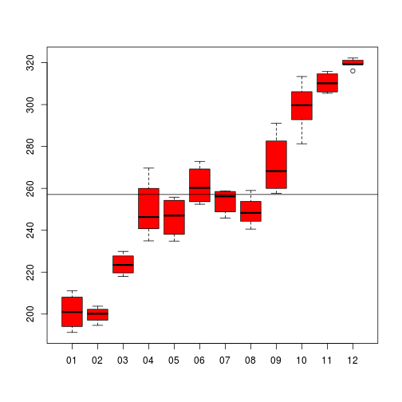

#B.1

```r
M <- matrix(0,5,5)

l <- c(1:5)

for(i in seq(1:5)){
  M[i,] <- l^i
}

x <- det(M)
y <- det(t(M))

trunc(x,0) == trunc(y,0)
```

```
## [1] TRUE
```

#B.2

```r
library(gcookbook)

#i
a <- subset(aapl, format(aapl$date, "%Y") == "2010")
mean(a$adj_price)
```

```
## [1] 258.8906
```

```r
summary(a)
```

```
##       date              adj_price    
##  Min.   :2010-01-08   Min.   :191.2  
##  1st Qu.:2010-04-07   1st Qu.:234.9  
##  Median :2010-07-05   Median :256.0  
##  Mean   :2010-07-05   Mean   :258.9  
##  3rd Qu.:2010-10-02   3rd Qu.:291.5  
##  Max.   :2010-12-31   Max.   :322.2
```

#ii

```r
data <- subset(aapl, format(aapl$date, "%Y") == "2010")
ag <- aggregate(data, by = list(format(data$date, "%m")), mean)
boxplot(data$adj_price ~ format(data$date, '%m'),col = 'red')
abline(h=mean(ag$adj_price))
```

 

#iii

```r
diff <- c()
v <- ag$adj_price
for(i in seq(2:12)){
  diff <- c(diff,v[i]-v[i-1])
}
plot(diff, type = 'l', xlab = 'meses', ylab = 'variacao do preco', col = 'red')
abline(h=0)
```

 

#iv
Com o lancamento do ipad, em janeiro de 2010, nota-se claramente que a tendência foi de aumento das acoes durante todo o ano de 2010.


```r
a <- subset(aapl, format(aapl$date, "%Y") == "2010")
plot(a, type = 'l', main = 'Lancamento do ipad (Anunciado em 27/01/2010)', xlab = 'Meses do ano 2010', ylab = 'Pre?o das a?oes')
```

 


#B.3

```r
sao_disjuntos <- function(A,B){
  disjuntos <- T
  C <- A %in% B
  if(T %in% C){
    disjuntos <- F
  }
  disjuntos
}

#Teste 1: nao disjuntos
A <- c(1,2,3)
B <- c(3,5,6)

sao_disjuntos(A,B)
```

```
## [1] FALSE
```

```r
#Teste 2: disjuntos
A <- c(1,2,3)
B <- c(4,5,6)

sao_disjuntos(A,B)
```

```
## [1] TRUE
```
