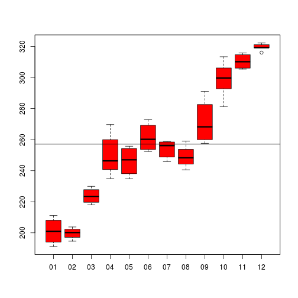

O objetivo do relatorio e fazer uma analise exploratoria das acoes da Apple. Essas informacoes foram obtidas atraves do dataset *aapl*, disponibilizado pela biblioteca **gcookbook**

##Descricao do dataset

```r
library(gcookbook)
summary(aapl)
```

```
##       date              adj_price     
##  Min.   :1984-09-07   Min.   :  1.66  
##  1st Qu.:1991-09-14   1st Qu.:  7.97  
##  Median :1998-09-21   Median : 10.68  
##  Mean   :1998-09-21   Mean   : 63.82  
##  3rd Qu.:2005-09-28   3rd Qu.: 51.09  
##  Max.   :2012-10-01   Max.   :700.09
```

##Exemplo dos dados


```r
head(aapl)
```

```
##         date adj_price
## 1 1984-09-07      3.01
## 2 1984-09-14      3.17
## 3 1984-09-21      3.05
## 4 1984-09-28      2.85
## 5 1984-10-05      2.83
## 6 1984-10-12      2.58
```


##Exemplo de grafico

Exemplo de grafico. Comportamento das acoes da Apple no ano de 2010. Em 27/01/2010 foi anunciado o lancamento do iPad, e desde entao e possivel verificar um aumento nas acoes.

 
