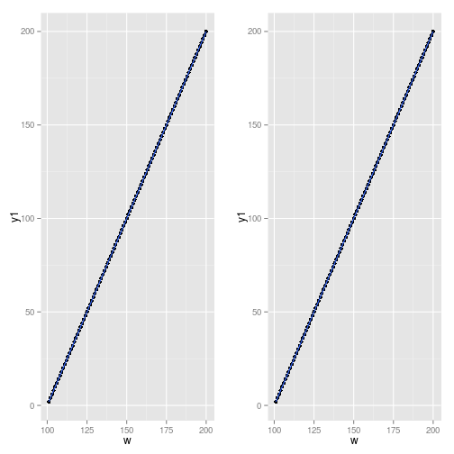
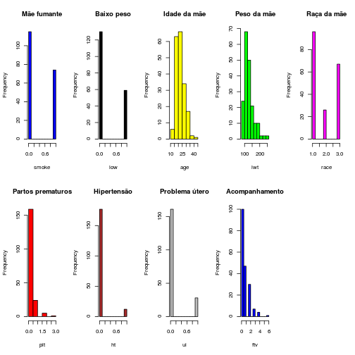

<br>

###Amostra

O dataset utilizado para a análise será o *birthwt*. Segue uma amostra da base:


```r
library(MASS)
head(birthwt)
```

```
##    low age lwt race smoke ptl ht ui ftv  bwt
## 85   0  19 182    2     0   0  0  1   0 2523
## 86   0  33 155    3     0   0  0  0   3 2551
## 87   0  20 105    1     1   0  0  0   1 2557
## 88   0  21 108    1     1   0  0  1   2 2594
## 89   0  18 107    1     1   0  0  1   0 2600
## 91   0  21 124    3     0   0  0  0   0 2622
```

<br>

###i. Histograma

A média de peso dos bebês é de aproximadamente 2.97kg. O valor abaixo de 2.5kg é considerado abaixo do esperado. Segue o histograma para o peso no nascimento dos bebês:


```r
bwt <- birthwt$bwt
mean(bwt)
```

```
## [1] 2944.587
```

```r
hist(bwt, col = 'red')
```

 

<br>

###ii. Analise exploratória

Para o inicio da analise, calculamos a media, desvio padrão e mediana para todas as variáveis numéricas do *dataset*:


```r
num_variables <- birthwt[,c('age','bwt','lwt','ptl','ftv')]
meanList <- lapply(num_variables,mean)
medianList <- lapply(num_variables,median)
stdevList <- lapply(num_variables,sd)

df <- data.frame(round(unlist(meanList),2), unlist(medianList), round(unlist(stdevList),2))
names(df) <- c('media','mediana','desvio padrao')
df
```

```
##       media mediana desvio padrao
## age   23.24      23          5.30
## bwt 2944.59    2977        729.21
## lwt  129.81     121         30.58
## ptl    0.20       0          0.49
## ftv    0.79       0          1.06
```

<br>

Para as variáveis categóricas *low, smoke, ht, ui*, foi calculada a frequência em relação a toda a população, onde 0 = Não, e 1 = Sim. A variável *proporcao* gerada é a proporção dos eventos ocorrerem ( Sim / (Sim+Não) ):


```r
cat_variables <- birthwt[,c('low','smoke','ht','ui')]
modeList <- lapply(cat_variables,sum)

df <- data.frame(unlist(modeList))
df <- cbind(df, (nrow(birthwt) - df[,1]))
df <- cbind(df, round(df[,1] / nrow(birthwt),2))

names(df) <- c('sim', 'nao', 'proporcao')
df
```

```
##       sim nao proporcao
## low    59 130      0.31
## smoke  74 115      0.39
## ht     12 177      0.06
## ui     28 161      0.15
```
<br>

Já a variável *race* que possui 3 valores: 1 = branca, 2 = negra e 3 = outras:

```r
race <- birthwt[,c('race')]
raceF <- summary(as.factor(race))

names(raceF) <- c('Branca', 'Negra', 'Outras')
raceF
```

```
## Branca  Negra Outras 
##     96     26     67
```

<br>

####Histogramas

A seguir, histogramas para todas as variáveis:


```r
par(mfrow=c(2,5))
hist(birthwt$smoke, col = 'blue', main = 'Mãe fumante', xlab = 'smoke')
hist(birthwt$low, col = 'black',  main = 'Baixo peso', xlab = 'low')
hist(birthwt$age, col = 'yellow', main = 'Idade da mãe', xlab = 'age')
hist(birthwt$lwt, col = 'green', main = 'Peso da mãe', xlab = 'lwt')

hist(birthwt$race, col = 'magenta', main = 'Raça da mãe', xlab = 'race')
hist(birthwt$ptl, col = 'red', main = 'Partos prematuros', xlab = 'plt')
hist(birthwt$ht, col = 'brown', main = 'Hipertensão', xlab = 'ht')
hist(birthwt$ui, col = 'gray', main = 'Problema útero', xlab = 'ui')
hist(birthwt$ftv, col = 'blue', main = 'Acompanhamento', xlab = 'ftv')
```

 

<br>

###iii. Conclusão

Ao analisar histogramas e a proporção entre a ocorrência dos eventos *low* e *smoke*, aparentemente existe uma grande correlação entre o peso do bebê ser baixo uma consequência do fato da mãe ser fumante.

<br>
