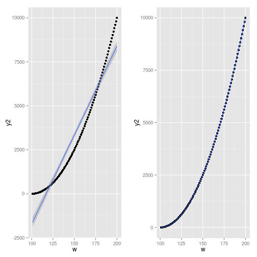
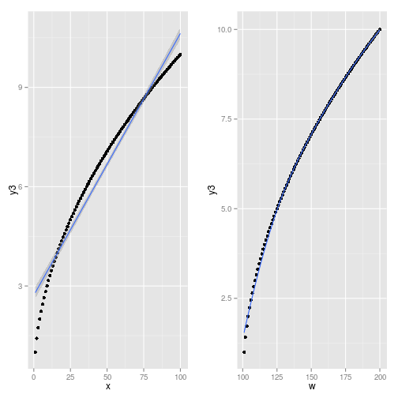
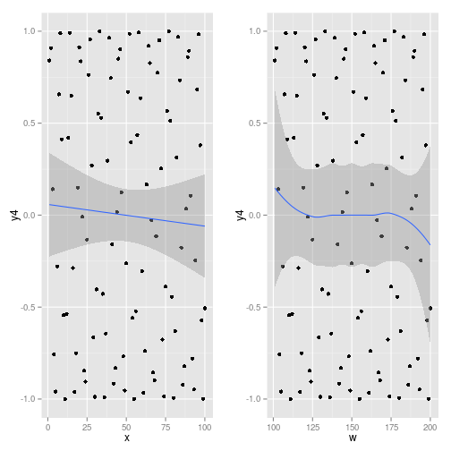

<br>

###Dados de entrada
Gerando o vetor de entrada *x*, as funções *y1, y2, y3, y4* e o vetor de teste *w*:

```r
x<-c(1:100)
y1<-2*x
y2<-x^2
y3<-sqrt(x)
y4<-sin(x)

w <- c(101:200)
```

<br>

###Estimando com Regressão linear e polinomial

Os gráficos abaixo foram gerados com o estimador linear *lm* e o polinomial *loess*. Para cada função *yn*, foram gerados dois plots comparando a eficiência dos estimadores.


```r
library(ggplot2)
library(gridExtra)

p1 <- qplot(w,y1) + geom_smooth(method=lm)
p2 <- qplot(w,y1) + geom_smooth(method=loess)
grid.arrange(p1, p2, ncol=2)
```

 

```r
p3 <- qplot(w,y2) + geom_smooth(method=lm)
p4 <- qplot(w,y2) + geom_smooth(method=loess)
grid.arrange(p3, p4, ncol=2)
```

 

```r
p5 <- qplot(x,y3) + geom_smooth(method=lm)
p6 <- qplot(w,y3) + geom_smooth(method=loess)
grid.arrange(p5, p6, ncol=2)
```

 

```r
p7 <- qplot(x,y4) + geom_smooth(method=lm)
p8 <- qplot(w,y4) + geom_smooth(method=loess)
grid.arrange(p7, p8, ncol=2)
```

 

<br>

###Conclusão

Percebe-se claramente que o estimador linear atende bem apenas o primeiro caso, interpolando perfeitamente a função afim *y1*. Para os demais casos, a regressão polinomial se adapta melhor à distribuição dos dados.

<br>
